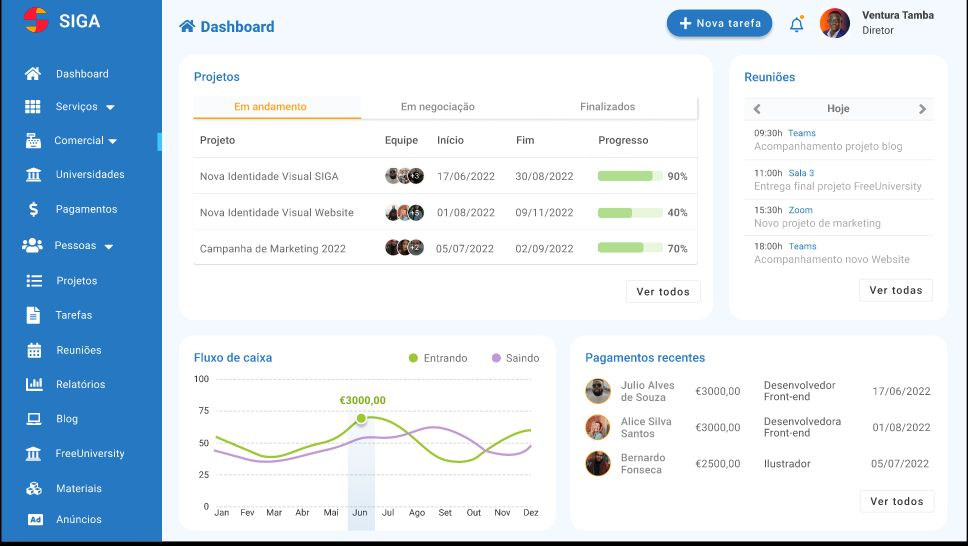
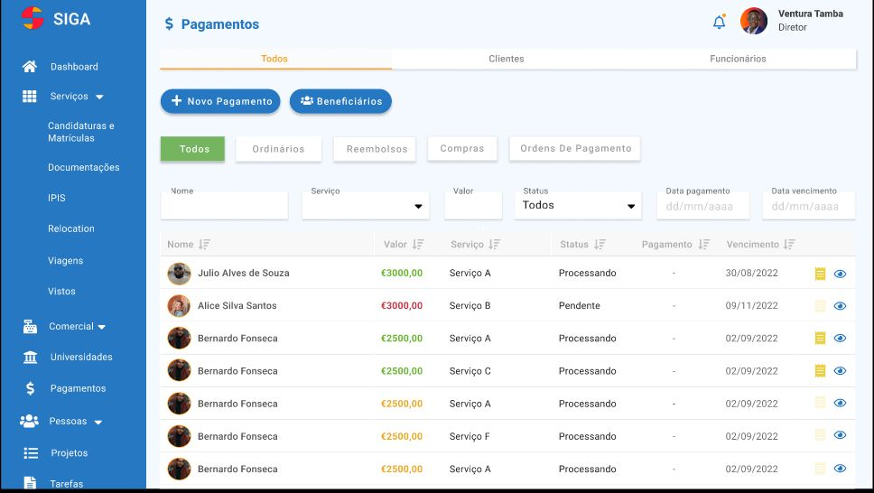

## Teste técnico para desenvolvedor(a) front-end:

1 : Projeto de página de destino: Crie uma página de destino para um site fictício, usando quadros para as diferentes seções da página (como cabeçalho, seção de recursos, seção de depoimentos etc.). Use os recursos de tipografia e cores do Figma para criar uma hierarquia visual e utilize componentes para reutilizar elementos em toda a página. Utilize gráficos e visualizações de dados para tornar as informações mais claras e fáceis de entender. Use o recurso de "Variáveis" do Figma para tornar o design mais dinâmico e atualizável.

exemplo:

Clone o projeto que está no GitHub : https://github.com/SrJohnathan/test-dev-frot-stw.git

Escolha uma das páginas e repasse o protótipo do Figma para o projeto rects.js com os máximos conhecimentos que você tem, pois aqui iremos analisar o seu conhecimento em front-end.

Fça uma documentação (README.md) junto com link do figma (Prototipagem)

O pull request deverá ser encaminhado

### O tempo para o término do teste é de 24 horas mediante este e-mail enviado.

